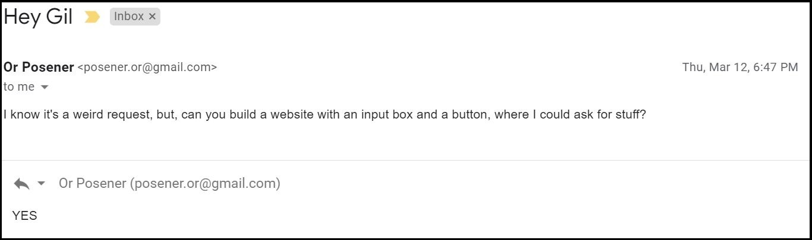
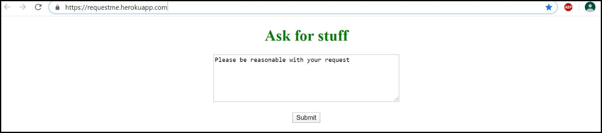
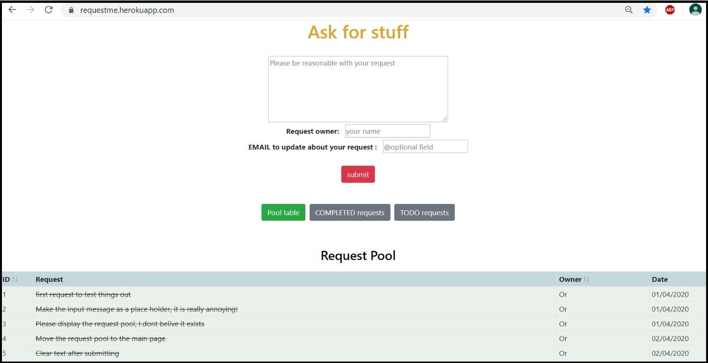
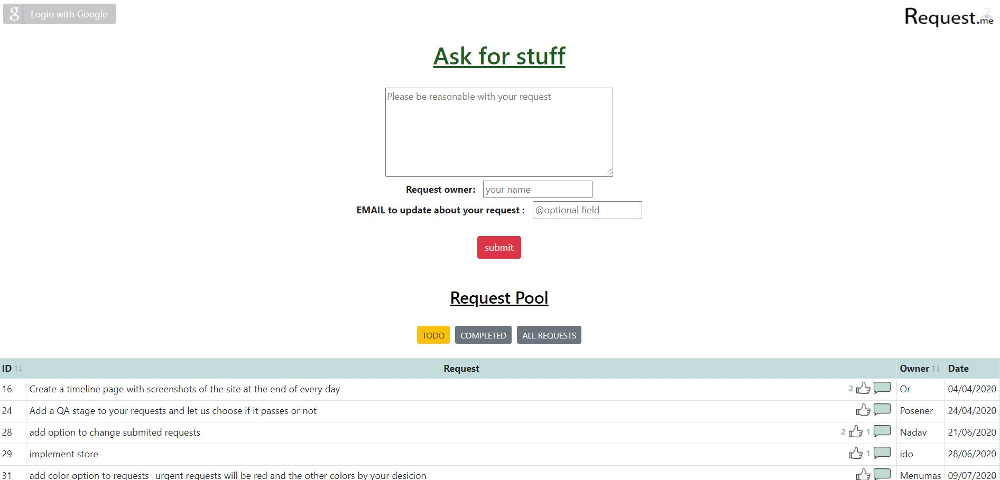
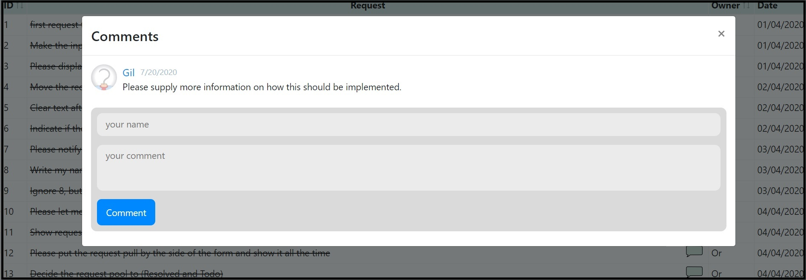
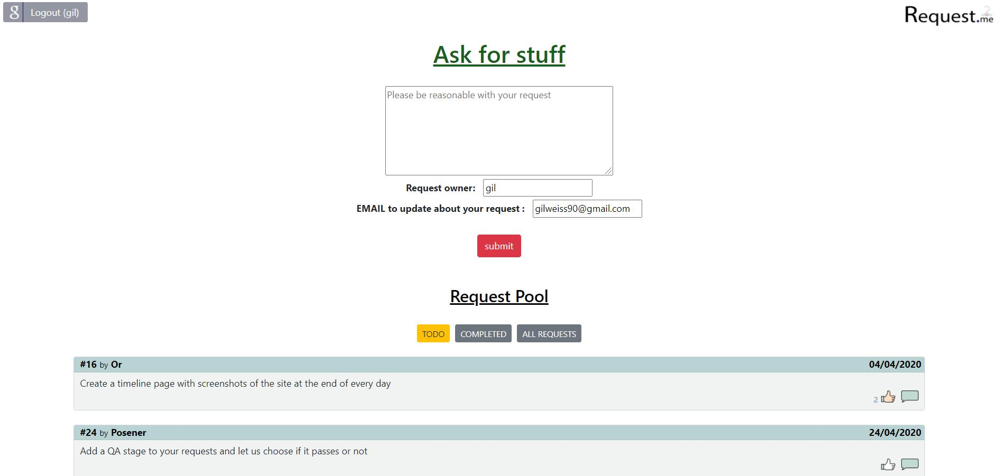

# Request.me
A fullstack web app driven by crowd requests.
Consists of a React client and an Express server (Node.js).
Integrating PostgreSQL and external authorizations via google, Deployed on Heroku:

https://requestme.herokuapp.com/

#### The concept:
The project started with an email from a friend, requesting to build a platform for additional requests. 
Since then, the project grew more and more according to the feature and development requests submitted in the app.

### Timeline:
#### The email that started this project: 
 
#### The app in day1: 
 
#### The app in day10: 
 
#### August 2020: 
 
####  
 
#### November 2020: 
 

